# dis-gui

An extensible, styleable, & React-based controller library inspired by the
venerable [dat-gui](https://github.com/dataarts/dat.gui).

<p align="center">
  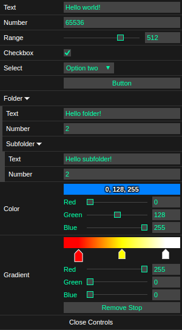
</p>

The above was created with the following JSX:

```js
import * as dg from 'dis-gui';

...

<dg.GUI>
  <dg.Text label='Text' value='Hello world!'/>
  <dg.Number label='Number' value={65536}/>
  <dg.Number label='Range' value={512} min={-1024} max={1024} step={64}/>
  <dg.Checkbox label='Checkbox' checked={true}/>
  <dg.Select label='Select' options={['Option one', 'Option two', 'Option three']}/>
  <dg.Button label='Button'/>
  <dg.Folder label='Folder' expanded={true}>
    <dg.Text label='Text' value='Hello folder!'/>
    <dg.Number label='Number' value={2}/>
    <dg.Folder label='Subfolder' expanded={true}>
      <dg.Text label='Text' value='Hello subfolder!'/>
      <dg.Number label='Number' value={2}/>
    </dg.Folder>
  </dg.Folder>
  <dg.Color label='Color' expanded={true} red={0} green={128} blue={255}/>
  <dg.Gradient label='Gradient' expanded={true}/>
</dg.GUI>
```

## Installation

`npm install dis-gui`

> Note: dis-gui has peer dependencies react@^15.3.0 react-addons-update@^15.3.1 react-dom@^15.3.0

## Events

The **onChange** event is fired when a control's value changes:

```js
<dg.GUI>
  <dg.Text
    label='Text' value='Hello world!'
    onChange={function(value) {console.log(value)}}
  />
</dg.GUI>
```

The **onFinishChange** event fires when the user performs some action that
indicates that they are finished changing a value, like hitting enter or tabbing
out of a text or number field, or releasing a mouse button after dragging a
number range thumb:

```js
<dg.GUI>
  <dg.Number
    label='Horses'
    value={2}
    min={0}
    max={4}
    step={0.1}
    onFinishChange={function(value) {console.log(value)}}
  />
</dg.GUI>
```

The **Button** control fires an **onClick** event:

```js
<dg.GUI>
  <dg.Button
    label='Run The Horses'
    onClick={function() {console.log('The horses are running.')}}
  />
</dg.GUI>
```

## Numbers

If you provide a **min** and **max** prop to the **Number** control, you'll get
a range slider and a number field:

```js
<dg.GUI>
  <dg.Number
    label='Horses'
    value={2}
    min={0}
    max={4}
    step={0.1}
    onFinishChange={function(value) {console.log(value)}}
  />
</dg.GUI>
```

<p align="center">
  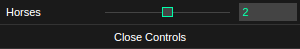
</p>

If you don't, it won't:

```js
<dg.GUI>
  <dg.Number
    label='Horses'
    value={2}
    onFinishChange={function(value) {console.log(value)}}
  />
</dg.GUI>
```

<p align="center">
  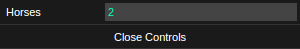
</p>

If the user enters a value that is not a number, the **onChange** and
**onFinishChange** event will not fire, and the value will be highlighted
with the value defined by **lowlighterr** in the **style** property of the
**GUI** component:

<p align="center">
  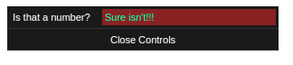
</p>

## Folders

Nest controls to arbitrary depth with the **Folder** component:

```js
<dg.GUI>
  <dg.Folder label='Folder 1'>
    <dg.Folder label='Folder 2'>
      <dg.Folder label='Folder 3'>
        <dg.Folder label='Folder 4'>
          <dg.Folder label='Folder 5'>
            <dg.Text label='You' value='...made it!'></dg.Text>
          </dg.Folder>
        </dg.Folder>
      </dg.Folder>
    </dg.Folder>
  </dg.Folder>
</dg.GUI>
```
<p align="center">
  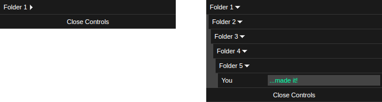
</p>

Pass the **expanded** prop a boolean to indicate if the folder
should start out open or closed:

```js
<dg.GUI>
  <dg.Folder label='Folder 1' expanded={true}>
    <dg.Text label='You' value='...made it!'></dg.Text>
  </dg.Folder>
</dg.GUI>
```

<p align="center">
  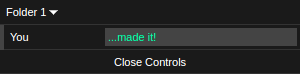
</p>

## Styling

Pass a **style** property to the **GUI** component to change its
appearance:

```js
<dg.GUI style={{
  paddingX: 3,
  paddingY: 3,
  backgroundColor: '#EEE',
  lowlight: '#DDD',
  lowlighterr: '#FBB',
  highlight: '#444',
  separator: '1px solid #DDD',
  label: {
    fontColor: '#444',
    fontWeight: 'normal'
  }
}}>
  <dg.Text label='Text' value='Hello world!'/>
  <dg.Number label='Number' value={65536}/>
  <dg.Number label='Range' value={512} min={-1024} max={1024} step={64}/>
  <dg.Checkbox label='Checkbox' checked={true}/>
  <dg.Select label='Select' options={['Option one', 'Option two', 'Option three']}/>
  <dg.Button label='Button'/>
  <dg.Folder label='Folder' expanded={true}>
    <dg.Text label='Text' value='Hello folder!'/>
    <dg.Number label='Number' value={2}/>
    <dg.Folder label='Subfolder' expanded={true}>
      <dg.Text label='Text' value='Hello subfolder!'/>
      <dg.Number label='Number' value={2}/>
    </dg.Folder>
  </dg.Folder>
  <dg.Color label='Color' expanded={true} red={0} green={128} blue={255}/>
  <dg.Gradient label='Gradient' expanded={true}/>
</dg.GUI>
```

<p align="center">
  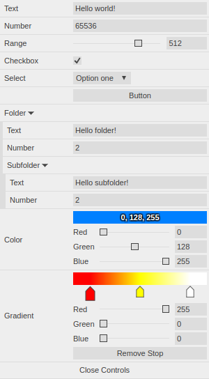
</p>

You can change the width of the labels and controls:

```js
<dg.GUI style={{ labelWidth: 100, controlWidth: 400 }}>
  <dg.Gradient label='Gradient' expanded={true}/>
</dg.GUI>
```

<p align="center">
  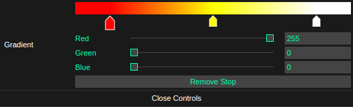
</p>

And you can position the whole thing:

```js
<dg.GUI style={{top: '0px', right: '0px'}}>
  <dg.Gradient label='Gradient' expanded={true}/>
</dg.GUI>

<dg.GUI style={{top: '0px', left: '0px'}}>
  <dg.Color label='Color' red={255} green={128} blue={64} expanded={true}/>
</dg.GUI>

<dg.GUI style={{bottom: '0px', right: '0px'}}>
  <dg.Text label='Text' value='So many positions!'/>
</dg.GUI>

<dg.GUI style={{bottom: '0px', left: '0px'}}>
  <dg.Number label='Number'/>
</dg.GUI>
```

<p align="center">
  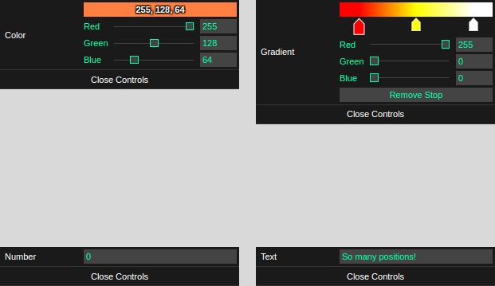
</p>

## Colors

**Color** controls take **red**, **green**, and **blue** props as numbers from
zero to 255:

```js
<dg.GUI>
  <dg.Color label='Some blue color' red={64} green={128} blue={255}/>
</dg.GUI>
```

<p align="center">
  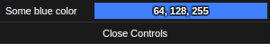
</p>

...and return an object like the following in their **onChange** and **onFinishChange**
events:

```js
{
  red: 64,
  green: 128,
  blue: 255
}
```

**Color** controls can be expanded by clicking on them, or you can pass the
**expanded** prop a boolean to expand them by default:

```js
<dg.GUI>
  <dg.Color label='Some blue color' red={64} green={128} blue={255} expanded={true}/>
</dg.GUI>
```

<p align="center">
  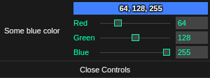
</p>

## Gradients

The **Gradient** control takes a **stops** prop, which is an array of objects
that have **red**, **green**, **blue**, and **stop** properties. The color
properties behave identically to the **Color** control, and the **stop** property
is a number from zero to one that represents the position of the stop.

```js
<dg.GUI>
  <dg.Gradient
    label='The floor is lava!'
    stops={[
      {red: 255, green: 0, blue: 0, stop: 0},
      {red: 255, green: 255, blue: 0, stop: 0.5},
      {red: 255, green: 255, blue: 255, stop: 1.0},
    ]}
  />
</dg.GUI>
```

<p align="center">
  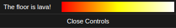
</p>

Like the **Color** control, the **Gradient** control will expand when the user
clicks it or if you add the **expanded** boolean property set to **true**:

```js
<dg.GUI>
  <dg.Gradient
    label='The floor is lava!'
    stops={[
      {red: 255, green: 0, blue: 0, stop: 0},
      {red: 255, green: 255, blue: 0, stop: 0.5},
      {red: 255, green: 255, blue: 255, stop: 1.0},
    ]}
    expanded={true}
  />
</dg.GUI>
```

<p align="center">
  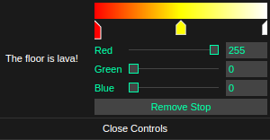
</p>
